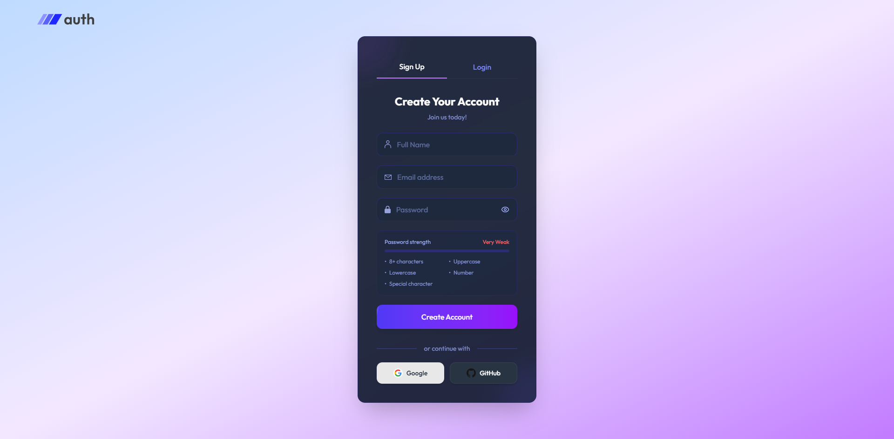
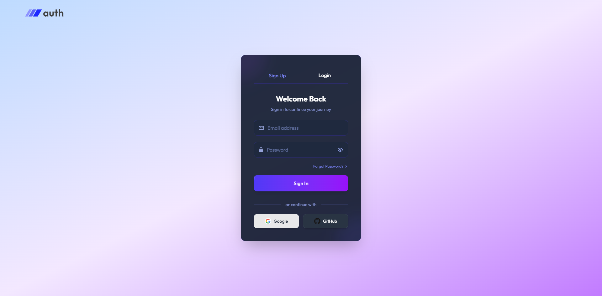

<h1 align="center">
  <br>
  Authentication System 🔐
  <br>
</h1>

<p align="center">
  A secure MERN authentication system with user registration, email verification, login, logout, password reset, profile management, and OAuth integration.
</p>

<table align="center">
  <tr>
    <th>Register Page</th>
    <th>Login Page</th>
  </tr>
  <tr>
    <td align="center">
      
    </td>
    <td align="center">
      
    </td>
  </tr>
</table>

## 🌟 Features

- **👤 User Registration** – Sign up with name, email, and secure password
- **✉️ Email Verification** – Account activation via secure verification links
- **🔐 Secure Login** – JWT-based authentication for email/password login
- **🔗 OAuth Integration** – Seamless login with Google and GitHub
- **🔑 Forgot Password** – Request a secure password reset link via email
- **🔄 Reset Password** – Update password using a time-limited token
- **🚪 Secure Logout** – Invalidate JWT tokens on user logout
- **⚡ Password Hashing** – bcrypt encryption for secure password storage
- **📧 Email Notifications** – Nodemailer-powered emails for verification and password resets
- **📱 Responsive UI** – Tailwind CSS for a clean, mobile-friendly interface

## ⚙️ Tech Stack

- **🎨 Frontend**: React, Tailwind CSS, React Router
- **🚀 Backend**: Node.js, Express.js
- **🗄 Database**: MongoDB, Mongoose
- **📧 Email Service**: Nodemailer, Brevo SMTP
- **🔐 OAuth**: Passport.js (Google & GitHub strategies)
- **🪙 Tokens**: JWT (JSON Web Tokens)

## 🛠️ Installation & Setup

### Prerequisites

- Node.js (v18 or higher)
- npm or yarn
- MongoDB Atlas account (or local MongoDB instance)
- Google OAuth Client ID & Secret
- GitHub OAuth Client ID & Secret

### Setup

1. **Clone the repository**

   ```bash
   git clone https://github.com/soumadip-dev/AuthSystem-MERN.git
   cd AuthSystem-MERN
   ```

2. **Backend Setup**

   ```bash
   cd server
   npm install
   ```

   Create a `.env` file in the `server` directory with:

   ```env
   PORT=8080
   MONGO_URI=<YOUR_MONGODB_URI>
   BASE_URL=http://127.0.0.1:8080
   FRONTEND_URL=http://localhost:5173
   NODE_ENV=development
   BREVO_HOST=smtp.brevo.com
   BREVO_PORT=587
   BREVO_USERNAME=<your_email_address>
   BREVO_PASSWORD=<your_email_password>
   BREVO_SENDEREMAIL=<your_email_address>
   JWT_SECRET=<your_secret_key>
   GOOGLE_CLIENT_ID=<your_google_client_id>
   GOOGLE_CLIENT_SECRET=<your_google_client_secret>
   GITHUB_CLIENT_ID=<your_github_client_id>
   GITHUB_CLIENT_SECRET=<your_github_client_secret>
   ```

3. **Frontend Setup**

```bash
cd ../client
npm install
```

Create a `.env` file in the `client` directory with:

```env
VITE_BACKEND_URL=<YOUR_BACKEND_URL>
VITE_FRONTEND_URL=<YOUR_FRONTEND_URL>
```

4. **OAuth Setup** 🔧

   - **Google OAuth**:

     - Go to [Google Cloud Console](https://console.cloud.google.com/)
     - Create a new project or select existing one
     - Configure OAuth consent screen
     - Create credentials (OAuth Client ID)
     - Add authorized redirect URIs: `http://localhost:8080/api/auth/google/callback`

   - **GitHub OAuth**:
     - Go to [GitHub Developer Settings](https://github.com/settings/developers)
     - Create a new OAuth App
     - Set Authorization callback URL: `http://localhost:8080/api/auth/github/callback`

5. **Run the Application** 🚀
   - Backend (Terminal 1):
     ```bash
     cd server
     npm run dev
     ```
   - Frontend (Terminal 2):
     ```bash
     cd ../client
     npm run dev
     ```
